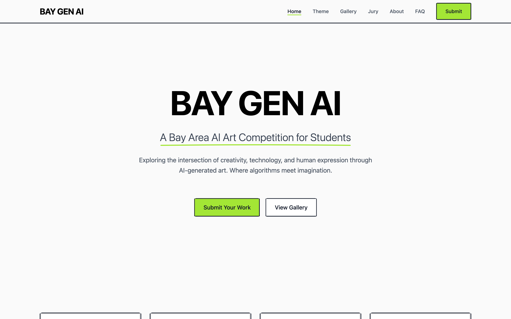

# BAY GEN AI

[](https://github.com/Lucassnam/Baygen/actions/workflows/ci.yml)

A Bay Area AI art competition for students. Entrants submit work, the public
browses a gallery, and a listed jury scores the field against a published theme.



## What is in here

| Page | What it does |
| --- | --- |
| Home | Theme, deadlines and the call for entries |
| Theme | The prompt entrants are working against |
| Gallery | Every accepted submission, filterable |
| Jury | Who is judging and what they are looking for |
| Submit | Entry form, writes through to Supabase |
| FAQ | Eligibility, rules and format questions |

## Stack

React 18, TypeScript, Vite, Tailwind CSS, Supabase for storage and submissions,
lucide-react for icons. Deployed on Vercel.

## Running it locally

```bash
npm ci
cp .env.example .env.local   # if present, otherwise create it
npm run dev
```

The app needs two environment variables, both from your Supabase project
settings:

```
VITE_SUPABASE_URL=https://your-project.supabase.co
VITE_SUPABASE_ANON_KEY=your-anon-key
```

Without them the Supabase client throws `supabaseUrl is required` at startup and
the page renders blank, so set them before the first run.

## Checks

```bash
npm run lint       # eslint
npm run typecheck  # tsc --noEmit
npm run build      # production bundle
```

All three run on every push through GitHub Actions.
